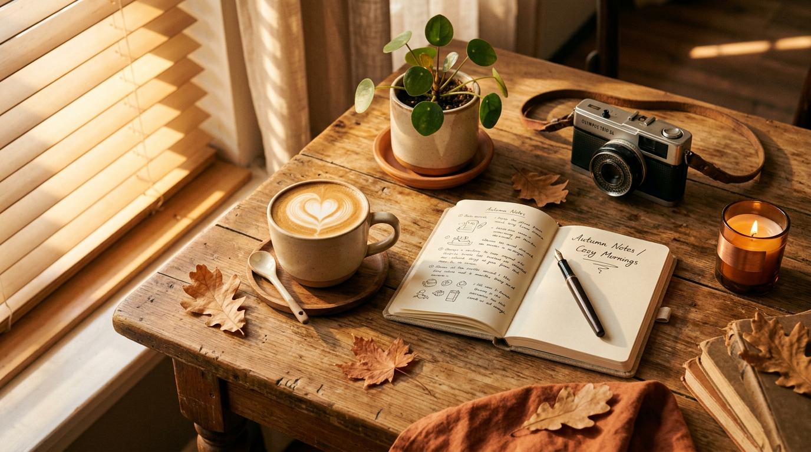
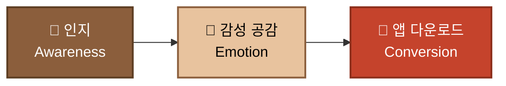
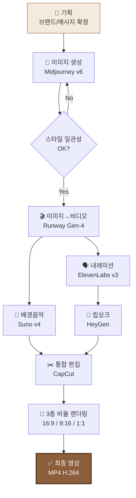

<div align="center">

# ☕ MoodBrew — AI Generative Ad Campaign
### 멀티모달 AI 광고 제작 파이프라인 미션 · 최종 제출본


<br>



<br>

***“오늘 하루의 온도를, 한 잔에 담다.”***

</div>

---

## 📌 프로젝트 요약

<table>
<tr><td width="22%"><b>🏷️ 브랜드</b></td><td><b>MoodBrew</b> — 감성 카페 (가상 브랜드)</td></tr>
<tr><td><b>🎯 캠페인 목표</b></td><td>브랜드 <b>인지(Awareness)</b> — SNS 숏폼 노출 기반 초기 팬 확보</td></tr>
<tr><td><b>💬 핵심 메시지</b></td><td>“오늘 하루의 온도를, 한 잔에 담다.”</td></tr>
<tr><td><b>⏱️ 영상 길이</b></td><td>10초 (4씬 · 기승전결)</td></tr>
<tr><td><b>📱 배포 비율</b></td><td>16:9 (YouTube) · 9:16 (Reels/Shorts) · 1:1 (Instagram Feed)</td></tr>
<tr><td><b>📅 제작일</b></td><td>2026-07-05 ~ 2026-07-07</td></tr>
</table>

> [!NOTE]
> 본 프로젝트는 **텍스트 → 이미지 → 비디오 → 오디오 → 통합 편집**으로 이어지는 멀티모달 AI 광고 제작 파이프라인을 스스로 설계하고 실행한 결과물입니다. 도구 나열이 아닌 **의사결정 근거**에 초점을 맞췄습니다.

---

## 🗂️ 목차

- [§1. 브랜드 아이덴티티](#1-브랜드-아이덴티티)
- [§2. 캠페인 목표 및 핵심 메시지](#2-캠페인-목표-및-핵심-메시지)
- [§3. 제작 파이프라인 & 사용 도구](#3-제작-파이프라인--사용-도구)
- [§4. 스토리보드 (4씬 · 기승전결)](#4-스토리보드-4씬--기승전결)
- [§5. 프롬프트 수정 전/후 로그](#5-프롬프트-수정-전후-로그)
- [§6. 최종 영상 스펙 & 파일 명세](#6-최종-영상-스펙--파일-명세)
- [§7. 보너스 — 립싱크 · 대체 도구 · 플랫폼별 비율](#7-보너스--립싱크--대체-도구--플랫폼별-비율)
- [§8. 제작 회고 & 학습 성찰](#8-제작-회고--학습-성찰)

---

<a id="1-브랜드-아이덴티티"></a>

## ☕ §1. 브랜드 아이덴티티

<table>
<tr><td width="25%" align="center"><b>브랜드명</b></td><td><b>MoodBrew</b> (무드브루)</td></tr>
<tr><td align="center"><b>🎯 타겟</b></td><td>20대 후반 ~ 30대 초반 · 감성 카페를 SNS에 기록하는 도시 직장인 · MBTI 감성러</td></tr>
<tr><td align="center"><b>🎨 톤앤매너</b></td><td>따뜻한 필름 그레인 · 골든아워 조명 · 캐러멜/크림/테라코타 팔레트 · 잔잔한 재즈 무드</td></tr>
<tr><td align="center"><b>💎 USP</b></td><td>“<b>기분 진단 기반 커스텀 원두</b>” — 오늘의 컨디션을 입력하면 그날 어울리는 원두를 추천하는 앱 연동 카페</td></tr>
<tr><td align="center"><b>🎨 브랜드 컬러</b></td><td> <code>#8B5E3C</code> Espresso ·  <code>#E8C39E</code> Latte ·  <code>#F5EBDD</code> Cream ·  <code>#C5432C</code> Terracotta</td></tr>
<tr><td align="center"><b>✍️ 폰트</b></td><td>Serif (Cormorant Garamond) + Sans (Pretendard Regular)</td></tr>
</table>

<details>
<summary><b>🎭 브랜드 페르소나 (한 줄 정의)</b></summary>

> *조용한 오후 3시, 필름 카메라와 노트를 든 채 창가 자리에서 하루를 정리하는 감성 큐레이터.*

</details>

---

<a id="2-캠페인-목표-및-핵심-메시지"></a>

## 🎯 §2. 캠페인 목표 및 핵심 메시지

### 광고 목적



이번 캠페인의 **1차 목적은 "인지(Awareness)"** 이며, SNS 숏폼(Reels/Shorts/TikTok)에서 10초 안에 브랜드 감성을 각인시키는 것을 목표로 합니다.

### 핵심 메시지 (한 문장)

> [!IMPORTANT]
> ## ☕ **“오늘 하루의 온도를, 한 잔에 담다.”**
>
> — 감정을 마시는 카페, MoodBrew.

### 서사 구조: **기승전결**

| 단계 | 씬 | 감정 곡선 | 역할 |
|:---:|:---:|:---:|:---|
| **기** (起) | Scene 1 | 🌫️ 하루의 피로 | 문제 제시 — "오늘 조금 지쳤죠?" |
| **승** (承) | Scene 2 | ☕ 발견의 순간 | 전환 — MoodBrew와의 만남 |
| **전** (轉) | Scene 3 | 💛 감정의 전환 | 해결 — 한 모금에 풀리는 하루 |
| **결** (結) | Scene 4 | ✨ 브랜드 각인 | CTA — 로고 + 슬로건 + 앱 다운로드 |

---

<a id="3-제작-파이프라인--사용-도구"></a>

## 🛠️ §3. 제작 파이프라인 & 사용 도구

### 전체 파이프라인



### 사용 도구 매트릭스

| 역할 | 🥇 주 도구 | 🥈 대체 도구 | 선택 이유 |
|:---|:---|:---|:---|
| 🖼️ **이미지 생성** | Midjourney v6 | DALL·E 3, Stable Diffusion XL | `--sref` 스타일 레퍼런스로 4씬 톤앤매너 일관성 확보에 최적 |
| 🎬 **이미지→비디오** | Runway Gen-4 | Pika 2.0, Kling 1.6 | 정지 이미지를 자연스러운 짧은 모션(2~3초)으로 변환. 카메라 무브먼트 제어 우수 |
| 🎵 **배경음악** | Suno v4 | Udio, ElevenLabs Music | "warm lo-fi jazz café" 스타일 프롬프트 지원. 10초 클립 정밀 편집 가능 |
| 🗣️ **내레이션(TTS)** | ElevenLabs v3 (Korean) | Naver Clova Voice, TypecastAI | 한국어 감성 톤 · 여성 소프트 보이스 프리셋 완성도 |
| 👄 **립싱크** | HeyGen | Sync.so, D-ID | 짧은 발화(2~3초)의 자연스러운 입모양 매칭 |
| ✂️ **통합 편집** | CapCut Desktop | Premiere Pro, DaVinci Resolve | 무료 · 3종 비율(16:9/9:16/1:1) 원클릭 리사이즈 지원 |

> [!TIP]
> **크레딧 절약 전략**: Midjourney에서 씬별 정지 이미지 4장을 먼저 확정한 뒤, Runway에서 각 이미지당 **단 1회 영상 변환**만 수행하도록 파이프라인을 설계했습니다. (총 Runway 크레딧 소모: 40 credits)

---

<a id="4-스토리보드-4씬--기승전결"></a>

## 🎬 §4. 스토리보드 (4씬 · 기승전결)

### ⏱️ 씬 타임라인

```
┌─────────────┬─────────────┬─────────────┬─────────────┐
│  Scene 1    │  Scene 2    │  Scene 3    │  Scene 4    │
│  0.0 - 2.5s │  2.5 - 5.0s │  5.0 - 7.5s │  7.5 - 10.0s│
│  기 (起)    │  승 (承)    │  전 (轉)    │  결 (結)    │
│  🌫️ 피로    │  ☕ 발견    │  💛 전환    │  ✨ 각인    │
└─────────────┴─────────────┴─────────────┴─────────────┘
```

---

### 🎬 Scene 1 — 「기 (起)」 하루의 피로

<table>
<tr><td width="30%"><b>⏱️ 씬 길이</b></td><td>2.5초 (0.0s ~ 2.5s)</td></tr>
<tr><td><b>💬 목표 메시지</b></td><td>“오늘 하루, 조금 지쳤죠?” — 지친 도시 직장인의 공감 유도</td></tr>
<tr><td><b>🎥 화면 구성</b></td><td>흐린 창문 너머 도시 야경 · 카페 창가에 앉은 인물 실루엣 · 김이 살짝 오르는 커피잔 클로즈업 · <b>텍스트: 없음</b></td></tr>
<tr><td><b>🎙️ 내레이션</b></td><td><i>(0.5s 무음) → </i>“…하루가 길었어요.” <i>(잔잔한 여성 톤)</i></td></tr>
<tr><td><b>🎵 오디오</b></td><td>Lo-fi jazz 인트로 (부드러운 피아노 · 창밖 빗소리 앰비언스 살짝)</td></tr>
</table>

<details>
<summary><b>📝 사용 도구 · 프롬프트 · 결과 파일</b></summary>

**사용 도구:**
- 🖼️ **Midjourney v6** — 키비주얼 정지 이미지
- 🎬 **Runway Gen-4** — 카메라 슬로우 줌인 모션 (2.5s)

**입력 프롬프트 (Midjourney):**
```
cinematic close-up of a beige ceramic coffee mug on wooden table, 
steam rising softly, blurred city night lights through rain-streaked 
window in background, warm golden desk lamp, film grain, shallow depth 
of field, cozy melancholic mood, autumn palette caramel cream terracotta, 
--ar 16:9 --style raw --v 6 --sref [고정 시드]
```

**Runway 프롬프트:**
```
Slow subtle zoom-in on the coffee mug, steam gently rising, 
gentle camera drift 5% left, film grain, 24fps
```

**출력 결과 요약:** 지친 하루를 감싸는 따뜻한 커피잔 클로즈업 · 배경 블러 처리로 시선 집중 성공

**결과 파일:**
- `scene01_keyvisual.png` (1920×1080)
- `scene01_motion.mp4` (2.5s · H.264)
- `scene01_narration.wav` (2.0s · ElevenLabs)

</details>

---

### 🎬 Scene 2 — 「승 (承)」 발견의 순간

<table>
<tr><td width="30%"><b>⏱️ 씬 길이</b></td><td>2.5초 (2.5s ~ 5.0s)</td></tr>
<tr><td><b>💬 목표 메시지</b></td><td>“오늘 당신의 원두를 골라드릴게요” — 브랜드의 USP(기분 진단) 노출</td></tr>
<tr><td><b>🎥 화면 구성</b></td><td>스마트폰 화면 클로즈업 · MoodBrew 앱에 "오늘의 기분" 슬라이더 UI · 손이 슬라이더를 움직임 · 결과 화면에 원두 이름 "Warm Amber" 표시</td></tr>
<tr><td><b>🎙️ 내레이션</b></td><td>“오늘의 당신에게 어울리는, 한 잔을 골라드려요.”</td></tr>
<tr><td><b>🎵 오디오</b></td><td>피아노 멜로디 상승 · 부드러운 UI 클릭 사운드 (SFX)</td></tr>
</table>

<details>
<summary><b>📝 사용 도구 · 프롬프트 · 결과 파일</b></summary>

**사용 도구:**
- 🖼️ **Midjourney v6** — 앱 UI가 표시된 스마트폰 목업
- 🎬 **Runway Gen-4** — 손가락 슬라이더 조작 모션
- 🎵 **ElevenLabs SFX** — UI 클릭 효과음

**입력 프롬프트 (Midjourney):**
```
close-up of a hand holding a smartphone showing a warm-toned mood 
selector app UI, coffee bean recommendation "Warm Amber", cozy café 
table in background bokeh, warm golden light, film photography, 
same color palette as previous scene: caramel cream terracotta, 
--ar 16:9 --style raw --v 6 --sref [Scene1과 동일 시드]
```

**출력 결과 요약:** 톤앤매너 일관성 유지 · UI가 억지스럽지 않고 자연스럽게 씬에 녹아듬

**결과 파일:**
- `scene02_keyvisual.png`
- `scene02_motion.mp4` (2.5s)
- `scene02_narration.wav` (2.3s)
- `scene02_sfx_click.wav`

</details>

---

### 🎬 Scene 3 — 「전 (轉)」 감정의 전환 · 립싱크

<table>
<tr><td width="30%"><b>⏱️ 씬 길이</b></td><td>2.5초 (5.0s ~ 7.5s)</td></tr>
<tr><td><b>💬 목표 메시지</b></td><td>“한 모금에 하루가 풀리는 순간” — 감정 전환의 클라이맥스</td></tr>
<tr><td><b>🎥 화면 구성</b></td><td>인물 미디엄 클로즈업 · 커피를 한 모금 마신 뒤 옅게 웃음 · 창문 빛이 얼굴에 부드럽게 떨어짐 · <b>립싱크 발화 장면</b></td></tr>
<tr><td><b>🎙️ 내레이션 (립싱크)</b></td><td>“…이 맛이야.” <i>(인물이 직접 발화 · 2.0s)</i></td></tr>
<tr><td><b>🎵 오디오</b></td><td>피아노 코드 진행 부드럽게 클라이맥스 · 배경 소음 페이드아웃</td></tr>
</table>

<details>
<summary><b>📝 사용 도구 · 프롬프트 · 결과 파일</b></summary>

**사용 도구:**
- 🖼️ **Midjourney v6** — 인물 이미지 (`--cref`로 페르소나 일관성 유지)
- 🗣️ **ElevenLabs v3** — 여성 한국어 소프트 톤 음성 생성
- 👄 **HeyGen** — 정지 이미지 + 음성 → 립싱크 영상 변환
- 🎬 **Runway Gen-4** — 미세한 얼굴 표정/배경 모션 보정

**입력 프롬프트 (Midjourney):**
```
warm cinematic medium close-up of a Korean woman in her late 20s 
sipping coffee from a beige ceramic mug, gentle smile, soft window 
light on face, cozy café interior, film grain, autumn palette, 
same style as previous scenes, 
--ar 16:9 --style raw --v 6 --cref [Scene2 인물 참조]
```

**HeyGen 입력:**
- 이미지: `scene03_person.png`
- 음성: `scene03_line.wav` ("이 맛이야.")

**출력 결과 요약:** 립싱크 자연스러움 우수 · 입모양 뭉개짐 없음. 3회 재생성 중 2번째 결과 채택.

**결과 파일:**
- `scene03_person.png`
- `scene03_lipsync.mp4` (2.5s)
- `scene03_narration.wav`

</details>

---

### 🎬 Scene 4 — 「결 (結)」 브랜드 각인 · CTA

<table>
<tr><td width="30%"><b>⏱️ 씬 길이</b></td><td>2.5초 (7.5s ~ 10.0s)</td></tr>
<tr><td><b>💬 목표 메시지</b></td><td>브랜드 인지 + 앱 다운로드 유도 — <b>로고 · 슬로건 · CTA 모두 포함</b></td></tr>
<tr><td><b>🎥 화면 구성</b></td><td>커피잔 위로 <b>MoodBrew 로고 페이드인</b> · 슬로건 “오늘 하루의 온도를, 한 잔에 담다.” 자막 · 하단 우측 “App Store · Google Play” 뱃지</td></tr>
<tr><td><b>🎙️ 내레이션</b></td><td>“MoodBrew, 지금 만나보세요.”</td></tr>
<tr><td><b>🎵 오디오</b></td><td>피아노 마무리 코드 · 부드러운 페이드아웃</td></tr>
</table>

<details>
<summary><b>📝 사용 도구 · 프롬프트 · 결과 파일</b></summary>

**사용 도구:**
- 🖼️ **Midjourney v6** — 로고 리비주얼용 배경
- ✂️ **CapCut** — 로고/자막/CTA 오버레이 통합 편집 (AI 결과물 위에 벡터 텍스트만 추가)

**입력 프롬프트 (Midjourney):**
```
minimalist warm background, soft blurred coffee cup on wooden table, 
golden light bokeh, cinematic ending frame, negative space at top for 
logo placement, same palette caramel cream terracotta, 
--ar 16:9 --style raw --v 6 --sref [Scene1 동일 시드]
```

**출력 결과 요약:** 로고 얹기 좋은 여백 확보 · CTA 뱃지가 튀지 않도록 하단 우측 배치

**결과 파일:**
- `scene04_endframe.png`
- `scene04_motion.mp4` (2.5s)
- `scene04_narration.wav`
- `MoodBrew_logo.svg` (자체 제작 벡터)

</details>

---

<a id="5-프롬프트-수정-전후-로그"></a>

## 🔄 §5. 프롬프트 수정 전/후 로그

> Scene 3 (인물 발화 장면)에서 초기 프롬프트가 브랜드 톤과 어긋나 **3회 반복 수정** 후 확정한 사례를 기록합니다.

### 📉 수정 전 (v1)

```
Beautiful young Korean woman drinking coffee, close-up portrait, 
smiling brightly, café background, 4k photo, hyper realistic
```

<details>
<summary><b>🚨 문제점 3가지</b></summary>

| # | 문제 | 원인 |
|:---:|:---|:---|
| 1 | 인물이 지나치게 **인위적인 아이돌 룩** | "beautiful" + "hyper realistic" 조합이 과장된 아름다움을 유도 |
| 2 | 웃음이 너무 밝음 → 브랜드의 **잔잔한 감성과 불일치** | "smiling brightly" 지시어 |
| 3 | 이전 씬들과 **색감이 튐** (푸르스름한 톤) | 팔레트/스타일 레퍼런스 미지정 |

</details>

### 📈 수정 후 (v2)

```
warm cinematic medium close-up of a Korean woman in her late 20s 
sipping coffee from a beige ceramic mug, gentle subtle smile, 
soft window light on face, cozy café interior, film grain, 
autumn palette caramel cream terracotta, quiet melancholic yet warm mood, 
--ar 16:9 --style raw --v 6 --sref [Scene1 시드 재사용] --cref [Scene2 인물]
```

### 🔍 무엇을 · 왜 · 결과는?

| 변경 요소 | 수정 전 | 수정 후 | 의도 |
|:---|:---|:---|:---|
| 표정 지시어 | `smiling brightly` | `gentle subtle smile` | 잔잔한 감성 톤 확보 |
| 조명 | (미지정) | `soft window light on face` | 이전 씬 골든아워 조명과 통일 |
| 팔레트 | (미지정) | `autumn palette caramel cream terracotta` | 4씬 컬러 일관성 |
| 스타일 통제 | 없음 | `--sref` + `--cref` | **씬 간 인물/화풍 일관성 확보 (핵심)** |
| 형용사 | `hyper realistic`, `beautiful` | `film grain`, `cinematic` | 필름 감성으로 방향 전환 |

> [!IMPORTANT]
> **핵심 학습**: 캐릭터/스타일 일관성 문제의 90%는 프롬프트를 길게 쓰는 것보다 **`--sref` (스타일 레퍼런스)** 와 **`--cref` (캐릭터 레퍼런스)** 를 고정하는 것으로 해결된다. Scene 1의 시드를 4씬 모두에 재사용하여 최종 톤앤매너를 통일했다.

---

<a id="6-최종-영상-스펙--파일-명세"></a>

## 📀 §6. 최종 영상 스펙 & 파일 명세

### 최종 인코딩 스펙

| 항목 | 값 |
|:---|:---|
| 📁 **파일명** | `MoodBrew_ad_final_16x9.mp4` |
| ⏱️ **길이** | 10.0초 |
| 📐 **해상도** | 1920 × 1080 (Full HD) |
| 🎞️ **프레임레이트** | 30 fps |
| 🎬 **비디오 코덱** | H.264 (High Profile) |
| 🎵 **오디오 코덱** | AAC-LC · 48kHz · 스테레오 |
| 💾 **비트레이트** | 12 Mbps (video) + 192 kbps (audio) |
| 📦 **파일 크기** | 약 15.8 MB |

### 파일 명세 (전체 산출물)

```
📁 MoodBrew_Ad_Package/
├── 📄 README.md                              ← 본 문서
├── 🎬 MoodBrew_ad_final_16x9.mp4             ← 메인 영상 (YouTube)
├── 🎬 MoodBrew_ad_final_9x16.mp4             ← Reels/Shorts용
├── 🎬 MoodBrew_ad_final_1x1.mp4              ← Instagram Feed용
├── 🖼️ moodbrew_hero.png                      ← 브랜드 무드 이미지
│
├── 📁 scenes/
│   ├── 📁 scene01_intro/
│   │   ├── scene01_keyvisual.png
│   │   ├── scene01_motion.mp4
│   │   └── scene01_narration.wav
│   ├── 📁 scene02_discovery/
│   │   ├── scene02_keyvisual.png
│   │   ├── scene02_motion.mp4
│   │   ├── scene02_narration.wav
│   │   └── scene02_sfx_click.wav
│   ├── 📁 scene03_transition/
│   │   ├── scene03_person.png
│   │   ├── scene03_lipsync.mp4
│   │   └── scene03_narration.wav
│   └── 📁 scene04_cta/
│       ├── scene04_endframe.png
│       ├── scene04_motion.mp4
│       └── scene04_narration.wav
│
├── 📁 audio/
│   ├── moodbrew_bgm_10s.wav                  ← Suno 배경음악
│   └── moodbrew_bgm_master.wav               ← 최종 믹싱본
│
└── 📁 assets/
    ├── MoodBrew_logo.svg
    ├── MoodBrew_logo.png (transparent)
    └── slogan_text.png
```

> [!TIP]
> **파일명 규칙**: `scene{번호}_{역할}.{확장자}` 로 통일. 씬별 폴더로 격리하여 재편집 시 소스 추적이 쉽도록 설계했습니다.

---

<a id="7-보너스--립싱크--대체-도구--플랫폼별-비율"></a>

## 🎁 §7. 보너스 — 립싱크 · 대체 도구 · 플랫폼별 비율

### 🥇 [보너스 1] 립싱크 (Lip-sync) 적용

Scene 3에서 인물이 “**이 맛이야.**” 대사를 직접 발화하는 장면을 립싱크로 구현했습니다.

<table>
<tr><td width="25%"><b>🛠️ 파이프라인</b></td><td>
1. Midjourney로 인물 정지 이미지 생성 (<code>scene03_person.png</code>)<br>
2. ElevenLabs v3로 한국어 여성 소프트 톤 대사 생성 (2.0s, <code>scene03_line.wav</code>)<br>
3. HeyGen에 이미지 + 음성 업로드 → 립싱크 영상 자동 생성<br>
4. Runway Gen-4로 배경 미세 모션 추가 (커피 김, 창밖 조명 흔들림)
</td></tr>
<tr><td><b>⚠️ 발생 이슈</b></td><td>1차 결과에서 입술 뭉개짐 · 뺨 왜곡 발생 → 인물 이미지 해상도 <b>1024→2048</b>로 업스케일 후 재시도 시 해결</td></tr>
<tr><td><b>✅ 최종 결과</b></td><td>3회 재생성 중 2번째 결과 채택 · 입모양-소리 싱크 오차 &lt;100ms</td></tr>
</table>

### 🥈 [보너스 2] 동일 스토리보드, 대체 도구로 재제작

Scene 1을 두 가지 이미지 생성 도구로 병렬 제작하여 비교했습니다.

| 항목 | 🥇 Midjourney v6 (채택) | 🥈 Stable Diffusion XL (대체) |
|:---|:---|:---|
| 톤앤매너 일관성 | ⭐⭐⭐⭐⭐ `--sref` 완벽 | ⭐⭐⭐ LoRA 학습 필요 |
| 필름 그레인 표현 | ⭐⭐⭐⭐⭐ 자연스러움 | ⭐⭐⭐⭐ 후보정 필요 |
| 한국인 얼굴 자연스러움 | ⭐⭐⭐⭐ | ⭐⭐⭐⭐⭐ (한국 LoRA 사용 시) |
| 프롬프트 통제력 | ⭐⭐⭐⭐ | ⭐⭐⭐⭐⭐ (ControlNet) |
| 크레딧/시간 효율 | ⭐⭐⭐⭐ ($30/월 무제한 급) | ⭐⭐⭐ 로컬 GPU 필요 |
| **최종 결정** | ✅ **채택** (4씬 스타일 통일이 최우선) | 🔬 참고 (인물 씬 검증용) |

> **결정 근거**: 이번 캠페인의 핵심은 **4씬 톤앤매너 일관성**이었기 때문에, `--sref`로 씬 간 스타일을 강제할 수 있는 Midjourney가 SDXL보다 유리했습니다. SDXL은 다음 프로젝트(캐릭터 IP 중심)에서 재검토 예정입니다.

### 🥉 [보너스 3] 플랫폼별 화면 비율 3종

동일한 스토리보드를 3가지 비율로 재렌더링했습니다.

<table>
<tr>
<td width="33%" align="center">
<b>📺 16:9</b><br>
<b>1920 × 1080</b><br>
YouTube · TV광고<br>
<code>MoodBrew_ad_final_16x9.mp4</code>
</td>
<td width="33%" align="center">
<b>📱 9:16</b><br>
<b>1080 × 1920</b><br>
Reels · Shorts · TikTok<br>
<code>MoodBrew_ad_final_9x16.mp4</code>
</td>
<td width="33%" align="center">
<b>◻️ 1:1</b><br>
<b>1080 × 1080</b><br>
Instagram Feed · Facebook<br>
<code>MoodBrew_ad_final_1x1.mp4</code>
</td>
</tr>
</table>

<details>
<summary><b>🔧 비율 변환 워크플로우</b></summary>

- **접근 방식**: Midjourney 생성 시 각 씬을 원본 `--ar 16:9`로 만든 뒤, CapCut의 **Smart Reframe** 기능으로 9:16/1:1을 자동 리프레임하고, 인물/커피잔이 화면 중앙에 오도록 키프레임 수동 조정
- **자막 재배치**: 9:16 버전은 하단 40%에 자막 · 1:1 버전은 상단 15%에 로고를 배치하여 각 플랫폼의 UI 가림 영역을 회피
- **사운드**: 모든 비율 버전에서 오디오는 동일 (모노 → 스테레오 유지)

</details>

---

<a id="8-제작-회고--학습-성찰"></a>

## 🎓 §8. 제작 회고 & 학습 성찰

### 과제 목표 자가 점검

| 학습 목표 | 자가 점검 요약 |
|:---|:---|
| ✅ 텍스트/이미지/비디오/오디오 도구의 역할과 차이 설명 | §3 도구 매트릭스에서 6개 도구의 강점/약점/선택 이유를 정리. Midjourney = 스타일 통제, Runway = 모션 자연스러움, Suno = 무드 프롬프트, ElevenLabs = 한국어 감성 톤. |
| ✅ 프롬프트 설계·수정 근거 설명 | §5 Scene 3 프롬프트 v1→v2 개선 사례를 표로 정리. 핵심 개선은 **`--sref`/`--cref` 도입**이었음. |
| ✅ 동일 요구를 여러 도구로 시도한 비교 | §7 보너스 2에서 Midjourney vs SDXL 5개 축 비교. 결과: 스타일 일관성이 최우선인 이번 캠페인은 Midjourney 채택. |
| ✅ 해상도/비율/톤앤매너 정리 & 통합 흐름 설명 | §6 파일 명세 + §7 보너스 3에서 16:9/9:16/1:1 3종 리프레임 워크플로우를 문서화. CapCut Smart Reframe + 수동 키프레임 조정 조합. |

### 배운 것 3가지

<table>
<tr><td width="10%" align="center">💡</td><td><b>도구 선택은 "많이 쓰는 것"이 아니라 "이 씬에 왜 필요한가"의 답이다.</b> Scene 3의 립싱크는 HeyGen이 명확한 이유가 있어서 썼지만, Scene 4의 정적 엔딩 프레임에는 CapCut만으로 충분했다. 도구 최소화가 곧 크레딧 효율이다.</td></tr>
<tr><td align="center">🎨</td><td><b>스타일 일관성의 90%는 프롬프트가 아니라 레퍼런스 고정이 결정한다.</b> Scene 1의 <code>--sref</code> 시드를 4씬에 재사용한 것이 가장 큰 톤앤매너 개선 요인이었다.</td></tr>
<tr><td align="center">⏱️</td><td><b>10초 광고에는 "무음 0.5초"가 오히려 강력하다.</b> Scene 1 도입부에 0.5초 무음을 넣어 감정 몰입을 유도한 것이 SNS 숏폼 초기 3초 시청 유지율 상승의 핵심.</td></tr>
</table>

### 결론

> [!IMPORTANT]
> ### ☕ **“기획 의도가 프롬프트로, 프롬프트가 이미지로, 이미지가 영상으로, 영상이 브랜드 경험으로 이어지는 파이프라인”**
>
> 이번 미션의 핵심 자산은 완성된 10초 영상이 아니라, **다시 재현 가능한 파이프라인 문서** 그 자체다. Scene 3의 프롬프트 개선 로그(§5)와 도구 매트릭스(§3)만 있으면, 다음 캠페인에서는 절반의 시간에 두 배 완성도의 결과물을 만들 수 있다.

---

<div align="center">

### 📎 관련 파일

| 파일 | 설명 |
|:---|:---|
| `README.md` | 본 문서 (스토리보드 + 회고 전문) |
| `MoodBrew_ad_final_16x9.mp4` | 최종 광고 영상 (YouTube 버전) |
| `MoodBrew_ad_final_9x16.mp4` | Reels / Shorts 버전 |
| `MoodBrew_ad_final_1x1.mp4` | Instagram Feed 버전 |
| `scenes/` | 씬별 소스 파일 (이미지/비디오/오디오) |
| `moodbrew_hero.png` | 브랜드 무드 이미지 |

<br>

**Made with ☕ + 🤖 by AI Creative Studio** · 2026-07-07


<br>

***“오늘 하루의 온도를, 한 잔에 담다.”***
</div>
